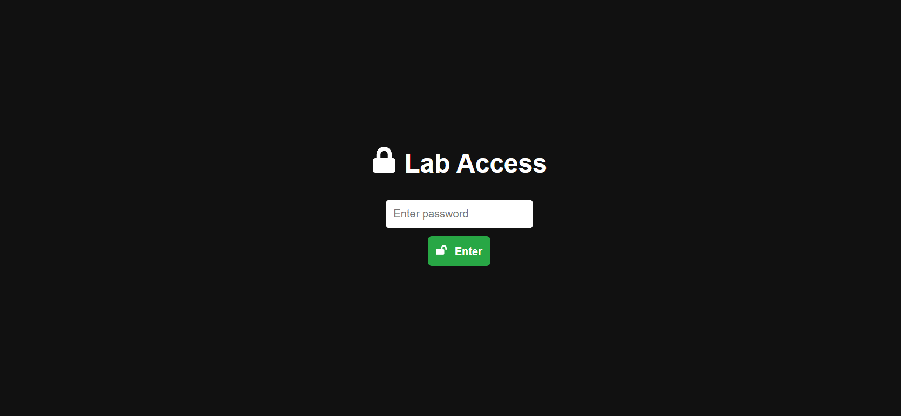
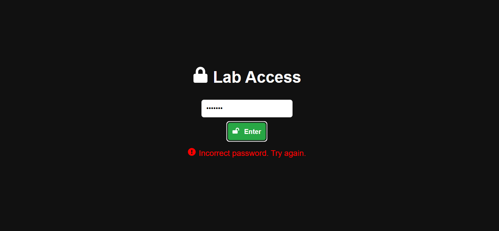
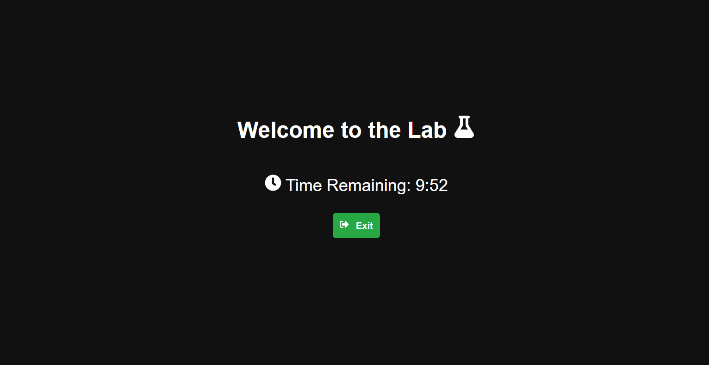

# Hairscope Lab 🧪 Access System

A password-protected lab access system built with React. This application provides a simple authentication mechanism, a timer for lab access, and a visual cue upon successful login. It's designed to simulate a secure environment where access is time-limited.

🚀 **Key Features**

*   **Password Authentication:** 🔐 Requires a correct password to grant access to the lab environment. The password is hardcoded for simplicity.
*   **Time-Limited Access:** ⏱️ Once logged in, a timer counts down from 10 minutes (600 seconds), automatically logging the user out upon expiration.
*   **Visual Feedback:** 🚪 A lock and door opening animation provides visual confirmation of successful login.
*   **Error Handling:** ❗ Displays an error message for incorrect password attempts.
*   **Real-time Timer Display:** The remaining time is displayed in `mm:ss` format, providing a clear indication of the remaining access duration.

🛠️ **Tech Stack**

*   **Frontend:**
    *   React: Core UI library
    *   React DOM: For rendering React components in the browser
    *   React Icons: For incorporating icons
    *   Framer Motion: For animations
*   **Build Tools:**
    *   React Scripts: For building and running the React application
    *   npm: Package manager
*   **Testing:**
    *   `@testing-library/dom`
    *   `@testing-library/jest-dom`
    *   `@testing-library/react`
    *   `@testing-library/user-event`
*   **Other:**
    *   web-vitals: For measuring web performance

📦 **Getting Started**

### Prerequisites

*   Node.js and npm installed on your machine.

### Installation

1.  Clone the repository:

    ```bash
    git clone <repository_url>
    cd hairscope-lab
    ```

2.  Install the dependencies:

    ```bash
    npm install
    ```

### Running Locally

1.  Start the development server:

    ```bash
    npm start
    ```

    This will start the application in development mode, usually accessible at `http://localhost:3000`.

💻 **Project Usage**

1.  Upon opening the application, you will be presented with a login form.
2.  Enter the correct password (hardcoded in `src/App.js`).
3.  If the password is correct, you will be logged in, and the timer will start. An animation will play.
4.  The remaining time will be displayed in `mm:ss` format.
5.  Once the timer reaches zero, you will be automatically logged out.
6.  You can also manually log out by clicking the "Exit Lab" button.

📂 **Project Structure**

```
hairscope-lab/
├── public/
│   ├── index.html          # Main HTML template
│   ├── favicon.ico         # Favicon
│   └── ...
├── src/
│   ├── App.js              # Main application component
│   ├── App.css             # Styles for App.js
│   ├── index.js            # Entry point of the React application
│   ├── index.css           # Global styles
│   └── reportWebVitals.js  # Web vitals reporting
├── package.json          # Project metadata and dependencies
├── README.md             # Project documentation (this file)
└── .gitignore            # Specifies intentionally untracked files that Git should ignore
```

📸 **Screenshots**








📬 **Contact**

If you have any questions or suggestions, feel free to contact me at [your-email@example.com](mailto:daveeddaveedd@gmail.com).

💖 **Thanks**

Thank you for checking out the Hairscope Lab Access System!

